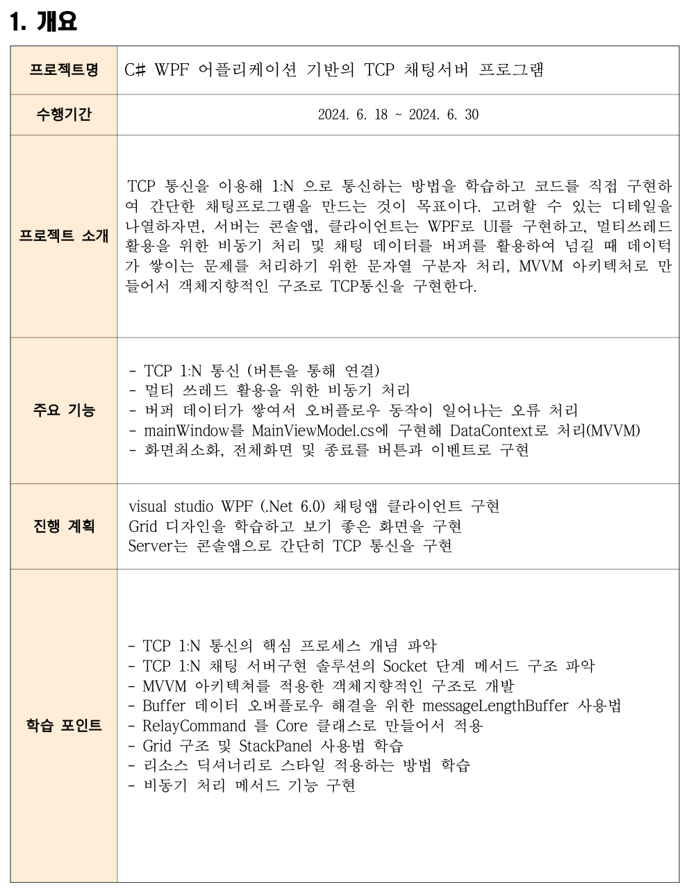

## 프로젝트 개요

### 프로젝트명
어플리케이션 기반의 채팅서버 프로그램 (C# WPF TCP)

### 수행기간
- 2024.6.18 - 2024.6.30

## 프로젝트 수행 계획 (요구사항, 기능 명세)




## 주요 기능
- 닉네임 기반 사용자 연결
- 메시지 전송 및 수신
- Firebase를 연동하여 채팅로그 저장
- 채팅방 별로 이전 채팅 불러오기
- MVVM 구조로 MainWindow가 MainViewModel을 호출

## TCP 서버-클라이언트 통신을 위한 로직 이해


- 소켓을 이용한 리스너/클라이언트의 구조를 파악하고 각 메서드의 역할을 나눠서 구현하게끔 노력
- 패킷리더와 패킷빌더를 정의하고 메시지 전송부분이 파싱되는 구조를 이해하려고 노력


## 소스코드 구성

다음 게시글에 정리해놨음

https://woogooree.github.io/ProjectT_02/


## 결과물


배울게 정말 많은 프로젝트 였음!


```toc

```

