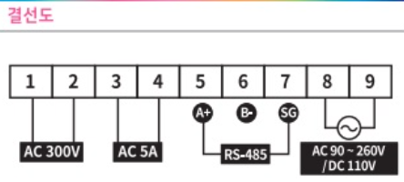
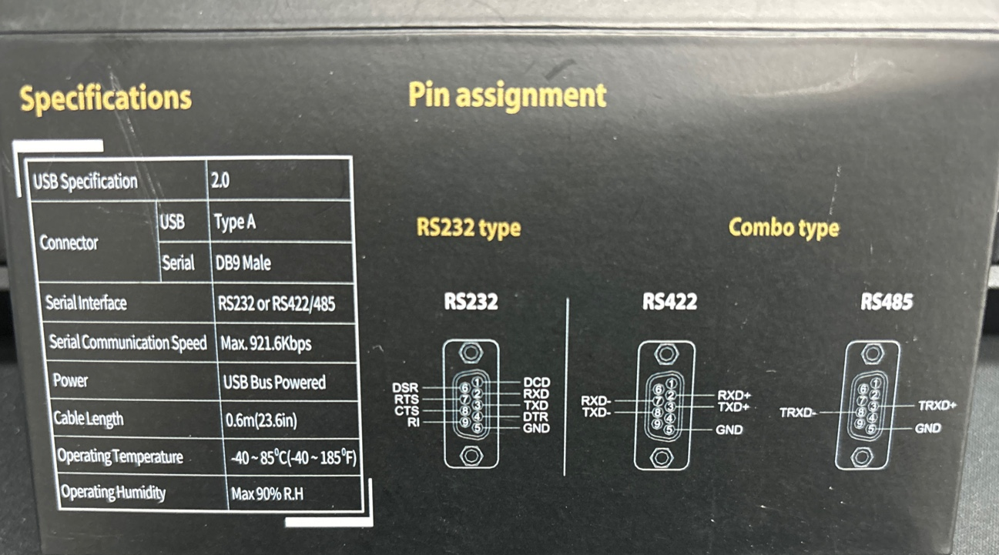

## RS485 통신 결선

### 결선도 설명



이미지에 나와 있는 결선도를 보면 다음과 같은 결선이 필요하다:

1. 1번 및 2번 핀: AC 300V 전원 공급
2. 3번 및 4번 핀: AC 5A 전원 공급
3. 5번 핀: A+ (RS485 통신선)
4. 6번 핀: B- (RS485 통신선)
5. 7번 핀: SG (Signal Ground)
6. 8번 및 9번 핀: AC 90~260V / DC 110V 전원 공급

### 결선 방법

1. **전원 결선**:
   - 1번과 2번 핀에 AC 300V 전원을 연결
   - 3번과 4번 핀에 AC 5A 전원을 연결
   - 8번과 9번 핀에 AC 90~260V 또는 DC 110V 전원을 연결

2. **RS485 통신선 결선**:
   - A+ (5번 핀)와 B- (6번 핀)을 각각 RS485 장치의 A+와 B-에 연결
   - SG (7번 핀)은 Signal Ground로 사용


## TX와 RX의 개념

- **TX (Transmit)**: 송신, 데이터를 보내는 역할
- **RX (Receive)**: 수신, 데이터를 받는 역할

RS485는 차동 신호를 사용하여 데이터 전송을 하기 때문에 TX와 RX의 구분이 없다. A+와 B- 두 개의 라인으로 데이터가 양방향으로 전송된다.

## Serial to USB로 데이터 수신



#### RS485 to USB 컨버터 핀 설명

컨버터 핀 배치와 각각의 의미는 다음과 같다:

- **TRXD+ (Transmit/Receive Data Positive)**: RS485의 A+ 선과 연결
- **TRXD- (Transmit/Receive Data Negative)**: RS485의 B- 선과 연결
- **GND (Ground)**: 신호 접지, RS485 장치의 SG와 연결

#### 단계별 연결 방법

1. **RS485 to USB 컨버터 준비**:
   - RS485 신호를 USB 신호로 변환하기 위해 RS485 to USB 컨버터가 필요하다.

2. **RS485 to USB 컨버터 연결**:
   - **TRXD+** (컨버터의 3번 핀)를 RS485 장치의 **A+** (5번 핀)에 연결
   - **TRXD-** (컨버터의 8번 핀)를 RS485 장치의 **B-** (6번 핀)에 연결
   - **GND** (컨버터의 5번 핀)를 RS485 장치의 **SG** (7번 핀)에 연결

3. **PC에 USB 연결**:
   - RS485 to USB 컨버터를 PC의 USB 포트에 연결

4. **시리얼 통신 소프트웨어 설치**:
   - Putty, Tera Term 또는 다른 시리얼 통신 소프트웨어를 설치하거나
   - Serial 통신을 구현하는 소프트웨어를 간단하게 만들어서 사용

5. **시리얼 포트 설정**:
   - 시리얼 통신 소프트웨어에서 적절한 COM 포트를 선택
   - 이 제품의 경우 전송속도는 9600bps/19200bps (반2중, 조보동기방식)
   - Data형식은 Start 1bit, Data 8bit, 패리티 None, Stop 1bit
   - 프로토콜 명은 Modbus RTU (인터페이스 : RS-485 2Wire)


```toc

```
