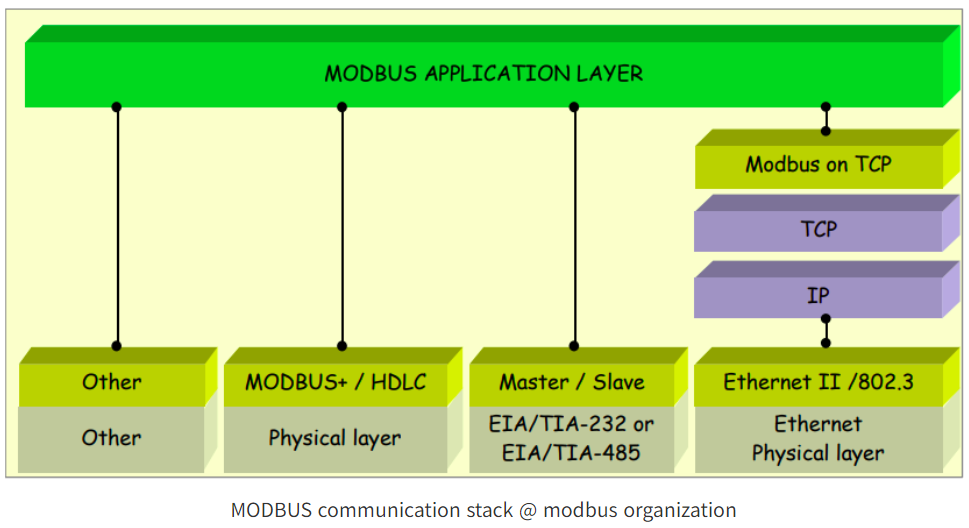

## Modbus RTU 프로토콜 (Serial Remote Terminal Unit)



Modbus 프로토콜은 시리얼과 TCP/UDP에서 활용할 수 있는데, 그중 시리얼통신인 485로 4선 통신하는 경우는 RTU가 많이 사용된다.
구매한 전력계 제품은 2선통신 임에도 설계하신 분이 RTU를 사용하는 설계를 사용하셔서 2선 통신으로 RTU 프로토콜을 사용해보게 되었다.

## 프레임 구조
- 슬레이브 주소 (Slave Address): 1 바이트 (0-255)
- 기능 코드 (Function Code): 1 바이트 (1-255)
- 데이터 (Data): n 바이트 (기능 코드에 따라 다름)
- CRC: 2 바이트

## 통신 방식
Modbus RTU는 마스터-슬레이브 구조를 사용한다. 마스터 디바이스는 통신을 시작하고 슬레이브 디바이스는 응답하는 형태로 동작한다. 한 번에 하나의 마스터만 존재할 수 있으며, 다수의 슬레이브가 존재할 수 있다.

## 주요 기능 코드
- 0x01: Read Coil Status (디지털 출력 상태 읽기)
- 0x04: Read Input Registers (아날로그 입력 레지스터 읽기)
- 0x05: Force Single Coil (단일 Coil 제어)
- 0x0F: Force Multiple Coils (다중 Coil 제어)
- 0x10: Preset Multiple Registers (다중 레지스터 제어)

### 예제
1. **0x01: Read Coil Status**
   - 요청 (Query):
     - 슬래이브 주소: 0x11
     - 기능 코드: 0x01
     - 레지스터 시작 주소: 0x0003
     - 포인트 수: 0x0012
   - 응답 (Response):
     - 슬래이브 주소: 0x11
     - 기능 코드: 0x01
     - 바이트 수: 0x03
     - 데이터: 0xCD, 0x6B, 0x02

2. **0x04: Read Input Registers**
   - 요청 (Query):
     - 슬래이브 주소: 0x0A
     - 기능 코드: 0x04
     - 레지스터 시작 주소: 0x0000
     - 포인트 수: 0x0002
   - 응답 (Response):
     - 슬래이브 주소: 0x0A
     - 기능 코드: 0x04
     - 바이트 수: 0x04
     - 데이터: 0x022B, 0x0064

3. **0x05: Force Single Coil**
   - 요청 (Query):
     - 슬래이브 주소: 0x11
     - 기능 코드: 0x05
     - 레지스터 주소: 0x0002
     - 제어 상태값: 0xFF00 (ON)
   - 응답 (Response):
     - 슬래이브 주소: 0x11
     - 기능 코드: 0x05
     - 레지스터 주소: 0x0002
     - 제어 상태값: 0xFF00

## CRC 검사
CRC는 전송 메시지의 끝에 추가되어 수신 측이 수신 데이터를 바이트씩 수신할 때마다 계산한 값과 비교하여 수신 에러 여부를 판단한다. CRC는 16비트로 구성되며, **전송 메시지에서 하위 바이트가 먼저 전송되고 상위 바이트가 뒤이어 전송된다.**

### CRC 코드 생성 방법 (C언어)
```c
byte OutBuff[32] = {0x00, 0x04, 0x00, 0x00, 0x00, 0x0F, 0x00, 0x00}; //전송 데이터 버퍼

void CRC_Maker(uint8_t *data, uint8_t length) {
    uint16_t C = 0xFFFF;  // CRC 초기값 0xFFFF로 16bit 모두 1
    uint8_t D; // 수신한 데이터 8bit
    uint16_t CY, DD;

    for (i = 0; i < length; i++) { // 모든 데이터가 수신될 때 까지 반복
        D = OutBuff[i];
        C = C ^ D;  // 수신한 8bit 와 하위CRC 8bit 를 Exclusive OR
        for (j = 0; j < 8; j++) {
            CY = C & 1; C = C / 2; C = C >> 1;
            // CRC 코드를 1bit씩 >> 하고 하위비트 값을 적출하고 상위비트는 0
            if (CY == 1) {
                C = C ^ 0xA001; //적출한 하위비트가 1이면 0xA001이랑 Exclusive OR
            }
        }
    }

    DD = C / 256;
    OutBuff[length] = (byte) (C - DD * 256) ;  // CRC_low
    OutBuff[length + 1] = (byte) DD;  // CRC_high
}
```
## 전력계에서 전력데이터를 가져오는 법

**0x04 (Read Input Registers) 를 사용해야 한다.**


## 내가 산 전력계의 통신 레지스터 주소 구성

### PM-B (PM-C, D, KCPM)
30001: 전압 1-2 (V12)
30002: 전압 2-3 (V23)
30003: 전압 3-1 (V31)
30004: 전류 1 (A1)
30005: 전류 2 (A2)
30006: 전류 3 (A3)
30007: 전력 (W)
30008: 역률 (Pf)
30009: 무효전력 (Var)
30010: 주파수 (Hz)
30011: 적산전력 상위 (Wh High)
30012: 적산전력 하위 (Wh Low)
30013: 적산무효전력 상위 (Varh High)
30014: 적산무효전력 하위 (Varh Low)


### 전력 사용량 데이터 요청 코드 예시 (C언어)

```c
#include <stdio.h>
#include <stdint.h>
#include <windows.h>

// CRC 계산을 위한 함수 선언
void CRC_Maker(uint8_t *data, uint8_t length);

// Modbus RTU 프레임을 슬레이브로 전송하는 함수
void sendModbusRequest(HANDLE hSerial, uint8_t slaveAddress, uint16_t startAddress, uint16_t registerCount);

// COM 포트 설정 함수
HANDLE setupSerialPort(const char* portName);

int main() {
    // COM 포트 설정
    HANDLE hSerial = setupSerialPort("COM4");

    // COM 포트 설정 실패 시 에러 메시지 출력 후 종료
    if (hSerial == INVALID_HANDLE_VALUE) {
        printf("Failed to open COM4 port\n");
        return 1;
    }

    // 슬레이브 주소, 시작 주소, 레지스터 수 설정
    uint8_t slaveAddress = 0x01;  // 슬레이브 주소
    uint16_t startAddress = 0x0000;  // 시작 주소 (전력 사용량 데이터의 시작 주소, 예시로 0x0000 설정)
    uint16_t registerCount = 0x0002;  // 요청할 레지스터 수 (2개의 레지스터, 4바이트 데이터)

    // 무한 루프를 통해 1시간마다 데이터 요청
    while (1) {
        // Modbus RTU 요청 전송
        sendModbusRequest(hSerial, slaveAddress, startAddress, registerCount);

        // 1시간 대기 (3600000 milliseconds = 1 hour)
        Sleep(3600000);
    }

    // 사용 완료 후 COM 포트 핸들 닫기
    CloseHandle(hSerial);
    return 0;
}

// CRC 계산 함수
void CRC_Maker(uint8_t *data, uint8_t length) {
    uint16_t C = 0xFFFF;  // CRC 초기값 0xFFFF 설정
    uint8_t D;
    uint16_t CY;

    // 주어진 데이터 배열을 순회하며 CRC 계산
    for (uint8_t i = 0; i < length; i++) {
        D = data[i];
        C = C ^ D;  // 데이터와 CRC 값 XOR 연산
        // 8비트씩 오른쪽으로 쉬프트하며 CRC 계산
        for (uint8_t j = 0; j < 8; j++) {
            CY = C & 1;  // 하위 비트 추출
            C = C >> 1;  // 오른쪽으로 1비트 쉬프트
            if (CY == 1) {
                C = C ^ 0xA001;  // 하위 비트가 1이면 XOR 연산
            }
        }
    }
    // CRC 값을 데이터 배열의 마지막 두 바이트에 추가
    data[length] = C & 0xFF;  // CRC_low
    data[length + 1] = (C >> 8) & 0xFF;  // CRC_high
}

// Modbus RTU 요청 전송 함수
void sendModbusRequest(HANDLE hSerial, uint8_t slaveAddress, uint16_t startAddress, uint16_t registerCount) {
    uint8_t request[8];  // 요청 프레임 (8바이트)

    // 요청 프레임 구성
    request[0] = slaveAddress;  // 슬레이브 주소 설정
    request[1] = 0x04;  // 기능 코드 설정 (0x04: Read Input Registers)
    request[2] = (startAddress >> 8) & 0xFF;  // 시작 주소 상위 바이트 설정
    request[3] = startAddress & 0xFF;  // 시작 주소 하위 바이트 설정
    request[4] = (registerCount >> 8) & 0xFF;  // 레지스터 수 상위 바이트 설정
    request[5] = registerCount & 0xFF;  // 레지스터 수 하위 바이트 설정

    // CRC 계산
    CRC_Maker(request, 6);  // 데이터 배열의 앞 6바이트를 사용하여 CRC 계산

    // 요청 프레임 전송
    DWORD bytesWritten;
    if (!WriteFile(hSerial, request, sizeof(request), &bytesWritten, NULL)) {
        // 전송 실패 시 에러 메시지 출력
        printf("Failed to write to COM port\n");
    } else {
        // 전송 성공 시 메시지 출력
        printf("Modbus RTU Request sent\n");
    }
}

// COM 포트 설정 함수
HANDLE setupSerialPort(const char* portName) {
    // 지정된 COM 포트를 여는 함수
    HANDLE hSerial = CreateFile(
        portName,  // 포트 이름
        GENERIC_READ | GENERIC_WRITE,  // 읽기 및 쓰기 설정
        0,  // 공유 모드 없음
        NULL,  // 보안 속성 없음
        OPEN_EXISTING,  // 기존 포트 열기
        FILE_ATTRIBUTE_NORMAL,  // 일반 파일 속성
        NULL  // 템플릿 파일 없음
    );

    // 포트 열기 실패 시 INVALID_HANDLE_VALUE 반환
    if (hSerial == INVALID_HANDLE_VALUE) {
        return INVALID_HANDLE_VALUE;
    }

    // 포트 설정 구조체 초기화
    DCB dcbSerialParams = {0};
    dcbSerialParams.DCBlength = sizeof(dcbSerialParams);

    // 현재 포트 상태 가져오기
    if (!GetCommState(hSerial, &dcbSerialParams)) {
        CloseHandle(hSerial);  // 실패 시 포트 핸들 닫기
        return INVALID_HANDLE_VALUE;
    }

    // 포트 설정 (9600bps, 8 데이터 비트, 1 스톱 비트, 패리티 없음)
    dcbSerialParams.BaudRate = CBR_9600;
    dcbSerialParams.ByteSize = 8;
    dcbSerialParams.StopBits = ONESTOPBIT;
    dcbSerialParams.Parity = NOPARITY;

    // 포트 설정 적용
    if (!SetCommState(hSerial, &dcbSerialParams)) {
        CloseHandle(hSerial);  // 실패 시 포트 핸들 닫기
        return INVALID_HANDLE_VALUE;
    }

    // 포트 타임아웃 설정
    COMMTIMEOUTS timeouts = {0};
    timeouts.ReadIntervalTimeout = 50;
    timeouts.ReadTotalTimeoutConstant = 50;
    timeouts.ReadTotalTimeoutMultiplier = 10;
    timeouts.WriteTotalTimeoutConstant = 50;
    timeouts.WriteTotalTimeoutMultiplier = 10;

    // 타임아웃 설정 적용
    if (!SetCommTimeouts(hSerial, &timeouts)) {
        CloseHandle(hSerial);  // 실패 시 포트 핸들 닫기
        return INVALID_HANDLE_VALUE;
    }

    // 성공 시 포트 핸들 반환
    return hSerial;
}

```

### 설명
1. 기능 코드 0x04 (Read Input Registers)를 사용하여 전력 사용량 데이터를 요청한다.
2. 요청 프레임을 구성하고 CRC를 계산하여 COM 포트를 통해 슬레이브 디바이스로 전송한다.
3. 1시간마다 요청을 전송하는 루프를 통해 주기적으로 데이터를 요청한다.

```toc

```
