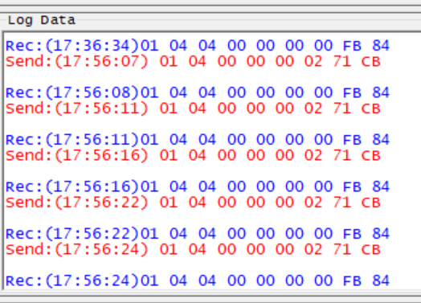

## Modbus 시작하기
Modbus는 일반적으로 장치간 SCADA 식의 네트워크 통신에 사용됩니다. 예를 들어, 대형 서버는 PLC 또는 PAC의 마스터가 될 수 있고, PLC/PAC는 또한 센서, 밸브, 모터 또는 기타 임베디드 장치의 마스터가 될 수도 있다.

이러한 요구를 충족하기 위해 Modbus는 유연적인 데이터 및 함수 모델을 갖춘 요청-응답 프로토콜로서 제작되었다.

### 요청-응답 구조
Modbus는 마스터-슬레이브 구조를 사용한다. 마스터 디바이스는 통신을 시작하고 슬레이브 디바이스는 응답하는 형태로 동작한다. 한 번에 하나의 마스터만 존재할 수 있으며, 다수의 슬레이브가 존재할 수 있다.

Modbus에서 요청은 여러 층으로 된 데이터의 세트이다. 첫 번째 계층은 Application Data Unit(ADU)로, 대부분의 사람들이 ADU를 Modbus의 유형이라고 생각하지만, ADU에는 ASCII, Remote Terminal Unit(RTU), TCP/IP의 세 가지가 있다.


## Modbus RTU 프로토콜 (Serial Remote Terminal Unit)


TCP는 소프트웨어에서 Modbus의 요청과 응답을 효율적으로 처리하고, 각 요청에 대한 전용 연결과 식별자를 통해 보다 효율적인 네트워킹을 구현하는 현대식 포맷이다. RTU와 ASCII는 좀 더 오래된 시리얼 ADU 포맷으로, 차이점은 RTU는 바이너리 형식으로 데이터를 표현하며 ASCII는 ASCII 문자로 요청을 보낸다는 점입니다.

Modbus 프로토콜은 시리얼과 TCP/UDP에서 활용할 수 있는데, 그중 시리얼통신인 485로 4선 통신하는 경우는 RTU가 많이 사용된다.

## 프레임 구조
- 슬레이브 주소 (Slave Address): 1 바이트 (0-255)
- 기능 코드 (Function Code): 1 바이트 (1-255)
- 데이터 (Data): n 바이트 (기능 코드에 따라 다름)
- CRC: 2 바이트

## 주요 기능 코드
- 0x01: Read Coil Status (디지털 출력 상태 읽기)
- 0x04: Read Input Registers (아날로그 입력 레지스터 읽기)
- 0x05: Force Single Coil (단일 Coil 제어)
- 0x0F: Force Multiple Coils (다중 Coil 제어)
- 0x10: Preset Multiple Registers (다중 레지스터 제어)

### 예제
1. **0x01: Read Coil Status**
   - 요청 (Query):
     - 슬래이브 주소: 0x11
     - 기능 코드: 0x01
     - 레지스터 시작 주소: 0x0003
     - 포인트 수: 0x0012
   - 응답 (Response):
     - 슬래이브 주소: 0x11
     - 기능 코드: 0x01
     - 바이트 수: 0x03
     - 데이터: 0xCD, 0x6B, 0x02

2. **0x04: Read Input Registers**
   - 요청 (Query):
     - 슬래이브 주소: 0x0A
     - 기능 코드: 0x04
     - 레지스터 시작 주소: 0x0000
     - 포인트 수: 0x0002
   - 응답 (Response):
     - 슬래이브 주소: 0x0A
     - 기능 코드: 0x04
     - 바이트 수: 0x04
     - 데이터: 0x022B, 0x0064

3. **0x05: Force Single Coil**
   - 요청 (Query):
     - 슬래이브 주소: 0x11
     - 기능 코드: 0x05
     - 레지스터 주소: 0x0002
     - 제어 상태값: 0xFF00 (ON)
   - 응답 (Response):
     - 슬래이브 주소: 0x11
     - 기능 코드: 0x05
     - 레지스터 주소: 0x0002
     - 제어 상태값: 0xFF00

## CRC 검사
CRC는 전송 메시지의 끝에 추가되어 수신 측이 수신 데이터를 바이트씩 수신할 때마다 계산한 값과 비교하여 수신 에러 여부를 판단한다. CRC는 16비트로 구성되며, **전송 메시지에서 하위 바이트가 먼저 전송되고 상위 바이트가 뒤이어 전송된다.**

### CRC 코드 생성 방법 (C언어)
```c
byte OutBuff[32] = {0x00, 0x04, 0x00, 0x00, 0x00, 0x0F, 0x00, 0x00}; //전송 데이터 버퍼

void CRC_Maker(uint8_t *data, uint8_t length) {
    uint16_t C = 0xFFFF;  // CRC 초기값 0xFFFF로 16bit 모두 1
    uint8_t D; // 수신한 데이터 8bit
    uint16_t CY, DD;

    for (i = 0; i < length; i++) { // 모든 데이터가 수신될 때 까지 반복
        D = OutBuff[i];
        C = C ^ D;  // 수신한 8bit 와 하위CRC 8bit 를 Exclusive OR
        for (j = 0; j < 8; j++) {
            CY = C & 1; C = C / 2; C = C >> 1;
            // CRC 코드를 1bit씩 >> 하고 하위비트 값을 적출하고 상위비트는 0
            if (CY == 1) {
                C = C ^ 0xA001; //적출한 하위비트가 1이면 0xA001이랑 Exclusive OR
            }
        }
    }

    DD = C / 256;
    OutBuff[length] = (byte) (C - DD * 256) ;  // CRC_low
    OutBuff[length + 1] = (byte) DD;  // CRC_high
}
```
## 전력계에서 전력데이터를 가져오는 법

**기능버퍼에 hex코드 0x04 (Read Input Registers) 를 사용해야 한다.**

## 전송 및 응답 결과




```toc

```
