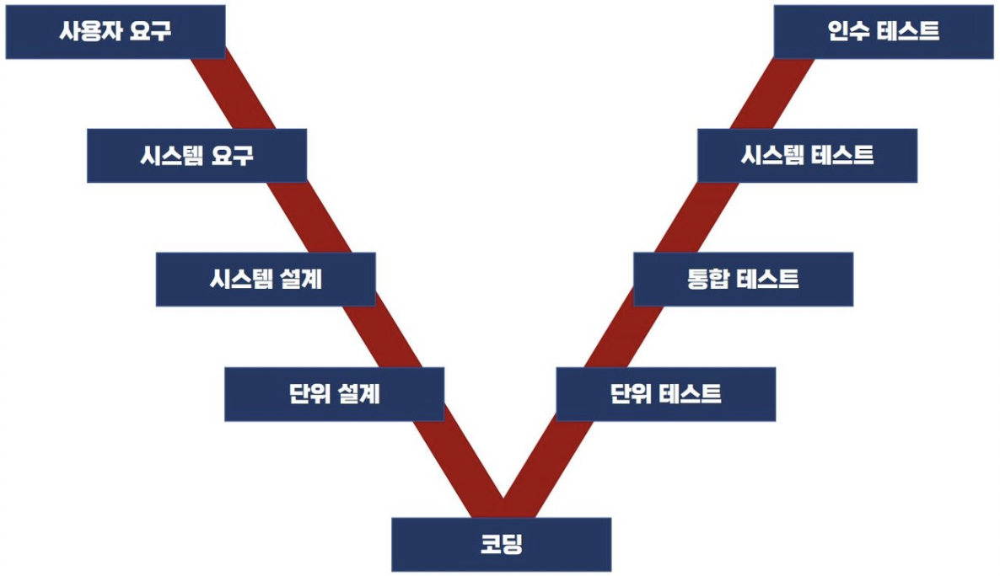

## 소프트웨어 테스트 원리

- 완벽한 테스팅은 불가능 (테스팅은 결함이 존재함을 밝히는것)
- 개발 초기에 테스팅 시작 (요르돈의 법칙)
- 파레토 법칙(Pareto Principle) : 오류의 80%는 전체 모듈의 20% 안에서 발견
- 살충제 패러독스(Pesticide Paradox) : 동일한 테스트 케이스에 의한 반복적 테스트는 새로운 버그를 찾지 못함
- 오류-부재의 궤변 : 요구사항을 충족시키지 못하다면, 결함이 없다고해도 품질이 높다고 볼 수 없음


## 테스트 시각에 따른 분류

검증(Verification) : 소프트웨어 개발 과정을 테스트, 개발자 혹은 시험자의 시각
확인(Validation) : 소프트웨어 결과를 테스트, 사용자 시각


## 테스트 V 모델




## 테스트 레벨 종류

- 단위(Unit) 테스트 : 구현이 진행될 때 모듈 및 컴포넌트 등을 테스트 (정적/동적)
- 통합(Integration) 테스트 : 모듈 간 인터페이스 관련 테스트 
- 시스템(System) 테스트 : 단위 시스템 기능이 시스템에서 정상 수행 되는지를 검증하는 테스트
- 인수(Acceptance) 테스트
    - 알파 테스트 : 사용자가 개발자 환경에서 수행하는 테스트
    - 베타 테스트 : 일정 사용자에게 자기 환경에서 소프트웨어를 사용하게하는 테스트


## 단위테스트 (정적, 동적)

### 정적테스트

- 정적 분석 : 자동화된 도구를 이용하여 산출물의 결함을 검출하거나 복잡도를 측정
- 인스펙션(동료검토) : 형식적 검토, 다른 전문가 또는 팀이 검사하여 문제를 식별
- 워크스루 : 비형식적 검토, 검토 자료를 배포해서 사전 검토한 후 짧게 회의 진행

### 동적테스트

- 화이트박스 테스트(구조 기반 테스트, 매우 중요)
    - 구문(문장) 커버리지(Statement) : 모든 명령문을 적어도 한 번씩 수행
    - 결정(분기) 커버리지(Decision) : 모든 결정 분기를 적어도 한  번씩수행
    - 조건 커버리지(Condition) : 전체조건과 무관하게 각 개별 조건이 한 번씩 수행
    - 조건/결정 커버리지(Condition/Decision) : 전체 조건이 참일 때 개별 조건 한 번씩 수행, 거짓일 때 또 한 번씩 더 수행
    - 변경 조건/결정 커버리지(MC/DC; Modified Condition/Decision) : 개별 조건이 독립적으로 결정 분기에 영향을 주는 경우의 수를 추가해서 수행
    - 다중 조건 커버리지(Multiple Coverage) : 결정 조건 내 모든 개별 조건식의 모든 경우의 수 100% 보장
    - 기본 경로 커버리지(Base Path Coverage) : 수행 가능한 모든 경로를 테스트
        - 맥케이브 복잡도 : 간선 수 – 노드 수 + 2
    - 제어 흐름 테스트(Control flow) : 프로그램 제어 구조를 그래프 형태로 나타내어 내부 로직 테스트
    - 데이터 흐름 테스트(Date flow) : 제어 흐름 그래프에 데이터 사용현황 추가

- 블랙박스 테스트(명세 기반 테스트)
    - 동등분할 테스트(Equivalence Partitioning) : 입력 데이터의 영역을 그룹핑하여 대푯값으로 테스트
    - 경곗값 분석 테스트(Boundary Value Analysis) : 최솟값 바로 위, 최대치 바로 아래 등 범위의 끝부분으로 테스트
    - 결정 테이블 테스트(Decision Table) : 요구사항의 논리와 발생조건을 테이블 형태로 나열하여, 조건과 행위를 모두 조합하여 테스트
    - 상태 전이 테스트(State transition) : 이벤트에 의해 어느 한 상태에서 다른 상태로 전이되는 경우의 수를 수행하는 테스트
    - 유스케이스 테스트(Use Case) : 프로세스 흐름을 기반으로 테스트케이스를 명세화하여 수행하는 테스트
    - 분류 트리 테스트(Classification Tree) : SW의 일부 또는 전체를 트리구조로 분석 및 표현하여 테스트 케이스 설계해 테스트
    - 페어와이즈 테스트(Pairwise) : 테스트 데이터 값들 간에 최소한 한 번씩을 조합하는 방식
    - 원인-결과 그래프 테스트(Cause-Effect Graphing) : 그래프를 활용해 입력 데이터 간의 관계 및 출력에 미치는 영향을 분석
    - 비교 테스트(Comparison) : 여러 버전의 프로그램에 같은 입력값을 넣어 비교해 테스트


## 테스트 오라클

테스트의 결과가 참인지 거짓인지를 판단하기 위해서 사전에 정의된 참값을 입력하여 비교하는 기법

- 참(True) 오라클 : 모든 입력값에 대해 기대하는 결과를 생성함으로써 발생된 오류를 모두 검출
- 샘플링(Sampling) 오라클 : 특정한 몇 개의 입력값에 대해서만 기대하는 결과를 제공
- 휴리스틱(Heuristic) 오라클 : 샘플링 오라클 + 나머지 값들은 휴리스틱(추정)으로 처리
- 일관성 검사(Consistent) 오라클 : 변경이 있을 때, 수행 전과 후의 결괏값이 동일한지 확인


## 통합 테스트

- 하향식 테스트 : 점증적으로 큰거부터 작은 모듈 순으로 테스트 테스트 스텁 필요
- 상향식 테스트 : 점증적으로 모듈부터 구현해서 조립된 큰거 순으로 테스트 테스트 드라이버 필요
- 샌드위치 테스트 : 상향식 + 하향식 테스트, 병렬 테스트 가능
- 빅뱅 테스트 : 모든 모듈을 동시에 통합 후 테스트


## 테스트 하네스

애플리케이션 컴포넌트 및 모듈을 테스트하는 환경의 일부분으로, 테스트를 지원하기 위한 코드와 데이터를 말하며, 단위 또는 모듈 테스트에 사용하기 위해 코드 개발자가 작성한다.

- 테스트 드라이버 : 상향식 테스트에서 하위 모듈을 드라이버로 설치해서 상위에서 인식하게 만듬
- 테스트 스텁 : 하향식 테스트에서 상위에서 하위로 접근할 수 없을 때 리더기 역할을 해줌
- 테스트 케이스 : 입력값, 실행 조건, 기대 결과 등의 집합
- 테스트 슈트 : 테스트 케이스 집합


## 시스템 테스트 종류 (기능/비기능 요구사항 만족 여부 위주)

- 회복 테스트(Recovery) : 시스템에 고의로 실패를 유도하고, 정상적 복귀 여부 테스트
- 안전 테스트(Security) : 소스 내 보안적인 결함을 미리 점검하는 테스트
- 구조 테스트(Structure) : 시스템의 내부 논리 경로, 소스 코드의 복잡도를 테스트
- 회귀 테스트(Regression) : 오류수정에 의한 새로운 오류가 없는지 확인하는 테스트
- 병행 테스트(Parallel) : 변경된 시스템과 기존 시스템에 동일한 테스트 후 결과 비교
- 성능 테스트(Performance) : 응답 시간, 반응 속도, 처리량 등을 측정하는 테스트


### 성능 테스트 상세 유형

- 부하(Load) : 시스템에 부하를 계속 증가시키면서 시스템의 임계점을 찾음
- 스트레스(Stress) : 임계점 이상의 부하를 가해 비정상적인 상황에서의 처리를 테스트
- 스파이크(Spike) : 짧은 시간에 사용자가 몰릴 때 시스템의 반응 측정 테스트
- 내구성(Endurance) : 오랜 시간 동안 시스템에 높은 부하를 가해 테스트


## 결함 분석 방법

- 구체화(Specification) : 결함을 발생시킨 입력값, 테스트 절차, 환경을 명확히 파악
- 고립화(Isolation) : 어떤 요소가 결함 발생에 영향을 미치는지 분석
- 일반화(Generalization) : 결함 발생에 영향을 주는 요소를 최대한 일반화 시키는 방법

## 성능테스트 관련 용어

- 처리량(Throughput) : 주어진 시간에 처리할 수 있는 트랜잭션의 수
- 응답 시간(Response Time) : 메뉴 클릭 시 해당 메뉴가 나타나기까지 걸리는 시간
- 경과 시간(Turnaround Time) : 사용자가 요구를 입력한 시점부터 결과 출력이 완료할 때까지 걸리는 시간
- 자원 사용률(Resource Usage) : CPU 사용량, 메모리 사용량, 네트워크 사용량


## 데이터베이스 관련 성능 저하 원인

- 데이터베이스 락(DB Lock) : 대량의 데이터 조회, 과도한 업데이트 시 발생하는 현상
- 불필요한 데이터베이스 패치(DB Fetch) : 대량의 데이터 요청이 들어올 경우 응답시간 저하 현상 발생
- 연결 누수 (Connection Leak): DB연결과 관련한 JDBC 객체를 사용 후 종료하지 않을 경우
- 부적절한 커넥션 풀 크기(Connection Pool Size) : 너무 작거나 크게 설정한 경우
베드 코드

## 다른 개발자가 로직을 이해하기 어렵게 작성된 코드

- 외계인 코드 : 아주 오래되거나 참고문서 또는 개발자가 없어 유지보수 작업이 어려운 코드
- 스파게티 코드 : 스파게티처럼 코드가 복잡하게 얽힘

## 클린 코드

잘 작성되어 가독성 높고, 단순하며, 의존성을 줄이고, 중복을 최소화해 잘 정리된 코드

- 코드 작성원리 : 가독성, 단순성, 의존성 최소, 중복성 제거, 추상화
- 느슨한 결합 : 인터페이스 클래스를 이용하여, 클래스 간의 결합도(의존성) 최소화


## 소스 코드 품질분석 도구

### 정적 분석도구
- pmd : 자바 및 타언어 소스 코드에 대한 버그, 데드코드 분석
- cppcheck : C/C++ 코드에 대한 메모리 누수, 오버플로우 등 문제 분석
- checkstyle : 자바 코드에 대한 코딩 표준 검사 도구

### 동적 분석도구
- Avalanche : Valgrind , STP 기반 소프트웨어 에러 및 취약점 동적 분석 도구
- Valgrind : 자동화된 메모리 및 스레드 결함 발견 분석 도구


```toc

```
