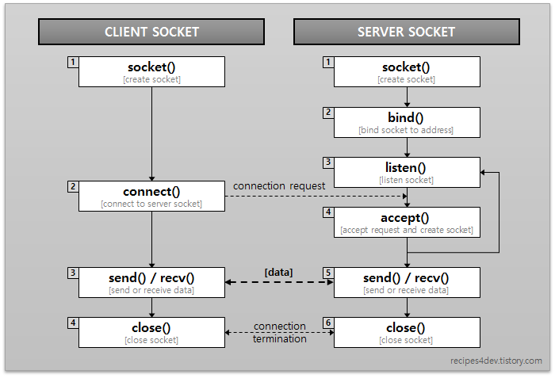

## 소켓(Socket)

프로그램이 네트워크에서 데이터를 송수신할 수 있도록 네트워크 환경에 연결할 수 있게 만들어진 연결부를 의미한다. 통신을 위한 프로토콜에 맞게 만들어져야 한다.

 

## 클라이언트 소켓과 서버 소켓

데이터를 주고받기 위해서는 소켓의 연결 과정이 선행되어야 한다.
연결을 만들기 위해서는 IP주소와 포트 번호로 식별되는 대상에게 연결을 요청하고 반대편이 연결요청(보낸이의 IP주소와 포트번호로 식별)을 미리 시스템에 등록하고 처리할 준비가 되어 있어야 한다.

- 연결요청을 보내는 쪽이 클라이언트 소켓
- 연결요청을 받으려고 대기하는 쪽이 서버 소켓


클라이언트 소켓과 서버 소켓은 역할과 구현 절차 구분을 위해 다르게 부르는 것일 뿐 내부 구조가 다르지 않다.

소켓 연결이 완료된 후, 클라이언트 소켓과 서버 소켓이 직접 데이터를 주고 받는다고 생각하기 쉽지만 사실 서버 소켓은 클라이언트 소켓의 연결 요청을 받아들이는 역할만 수행할 뿐이다. 
- 직접적인 데이터 송수신은 서버 소켓의 연결 요청 수락 결과로 만들어지는 새로운 소켓을 통해 처리된다.

다음은 소켓 API 실행 흐름을 한눈에 보여준다.




## 클라이언트 소켓 프로그래밍

1. 클라이언트 소켓 생성 ( socket() )
TCP 소켓을 위해서는 스트림(Stream) 타입을 생성
연결 대상(IP:Port)을 지정하고 연결 요청을 전달하기 위해서는 connect() API를 호출해야 한다.

2. 연결 요청 ( connect() )
connect() API는 IP주소와 포트 번호로 식별되는 대상으롤 연결 요청을 보낸다.
connect() API는 블록(Block) 방식으로 동작하기 때문에 연결 요청에 대한 결과가 결정되기 전에는 connect()의 실행이 끝나지 않는다. 
connect() API 호출이 성공하면 send() / recv() API를 통해 데이터를 주고 받을 수 있다.

3. 데이터 송수신 ( send() / recv() )
연결된 소켓을 통해 데이터를 보낼 때는 send(), 데이터를 받을 때는 recv() API를 사용한다. 
send()와 recv() API 역시 블록(Block) 방식으로 동작하기 때문에 두 API 모두 실행 결과가 결정되기 전까지는 API가 리턴되지 않는다.

send()의 경우 얼마만큼의 데이터를 보낼 것인지를 알 수 있다.
recv()의 경우 데이터가 언제 얼마나 올지 모르므로 API가 한번 실행되면 언제 끝날지 모르는 상태가 된다. 따라서 데이터 수신을 위한 recv() API는 별도의 스레드에서 실행한다. 소켓의 생성과 연결이 완료된 후, 새로운 스레드를 하나 만든 다음 그곳에서 recv()를 실행하고 데이터를 수신되길 기다리는 것이다.

4. 소켓 닫기 ( close() )
send() / recv() API를 통해 데이터 송수신이 완료되고 더 이상 송수신이 필요없게되면 close() API를 통해 소켓을 닫는다. 소켓 연결이 종료된 후 다시 데이터를 주고 받고싶다면 또 한번의 소켓 생성과 연결 과정을 통해 소켓 데이터를 송수신할 수 있는 상태가 되어야 한다.

 

## 서버 소켓 프로그래밍

1. 서버 소켓 생성 ( socket() )
클라이언트 소켓과 마찬가지로 서버 소켓을 사용하려면 최초에 소켓을 생성해야한다.

2. 서버 소켓 바인딩 ( bind() )
bind() API에 사용되는 인자는 소켓과 포트 번호(또는 IP 주소 + 포트 번호)이다. 
bind()는 소켓과 포트 번호를 결합하는 것이다.
bind() API는 해당 소켓이 지정된 포트 번호를 사용할 것이라는 것을 운영체제에 요청하는 역할을 한다. 
만약 지정된 포트 번호를 다른 소켓이 사용하고 있다면 bind() API는 에러를 리턴한다.

운영체제가 특정 포트 번호를 서버 소켓이 사용하도록 만들기 위해 소켓과 포트 번호를 결합(bind)해야 하는데 이 때 사용하는 API가 바로 bind()인 것이다.

3. 클라이언트 연결 요청 대기 ( listen() )
이제 클라이언트의 연결 요청 수신을 기다리게 되는데 이 역할을 listen() API가 수행한다.

listen() API는 서버 소켓에 바인딩된 포트 번호로 클라이언트의 연결 요청이 있는지 확인하며 대기 상태에 머무른다. 클라이언트에서 호출된 connect() API에 의해 연결 요청이 수신되면 대기 상태를 종료하고 리턴한다.

listen() API가 대기 상태에서 빠져나오는 경우는 클라이언트 요청이 수신되는 경우와 에러가 발생(소켓 close() 포함)하는 경우다. 그런데 listen() API가 성공하더라도 리턴 값에는 요청이 수신되었는지, 실패해서 에러가 발생했는지에 대한 정보만 있고, 요청에 대한 정보는 들어있지 않다.

대신 클라이언트 연결 요청에 대한 정보는 시스템 내부적으로 관리되는 큐(Queue)에 쌓이게 되는데, 이 시점에서 클라이언트와의 연결은 아직 완전히 연결되지 않은 대기 상태이다. 
대기 중인 연결 요청을 큐(Queue)로부터 꺼내와서 연결을 완료하기 위해서는 accept() API를 호출해야 한다.

4. 클라이언트 연결 수립 ( accept() )
listen() API가 클라이언트의 연결 요청을 확인하고 성공했음을 리턴했어도, 최종 연결 요청을 받아들이는 역할을 수행하는 API는 accept()이다.

accept() API는 연결 요청을 받아들여 소켓 간 연결을 수립하는데, 이 때 데이터 통신을 위해 연결되는 소켓은 bind(), listen() API에서 사용한 소켓이 아니라 accept() API 내부에서 새로 만들어진 소켓이다. 

이 새로 만들어진 소켓과, 포트 번호를 바인딩하고 클라이언트의 요청을 대기하기 위해 생성된 요청 대기 큐(Queue)에 쌓여있는 첫 번째 연결 요청이 매핑된다. 여기까지가 하나의 연결 요청을 처리하기 위한 서버 소켓의 역할이다. 서버 소켓의 남은 일은 또 다른 연결 요청을 처리하기 위해 다시 대기(listen)하거나, 서버 소켓을 닫는(close) 것 뿐이다.

5. 데이터 송수신 ( send() / recv() )
데이터를 송수신하는 과정은 클라이언트 소켓과 동일하다.

6. 소켓 연결 종료 ( close() )
클라이언트 소켓 처리 과정과 마찬가지로 소켓을 닫기 위해서는 close() API를 호출하면 된다.

서버 소켓에서는 close()의 대상이 최초 socket() API를 통해 생성한 소켓뿐만 아니라, accept() API를 통해 생성한 소켓도 있음을 유의해야 한다.

 

## 다중 클라이언트 처리

기본 서버-클라이언트 모델에서 서버는 한 번에 하나의 클라이언트만 처리한다. 따라서 다중 클라이언트를 처리하려면 멀티 프로세싱, 멀티 스레딩, 멀티 플렉싱 등을 활용해야 한다.

### 멀티 프로세싱

프로세스는 실행 중인 프로그램이라는 뜻으로 각각 독립된 메모리 영역(Code, Data, Stack, Heap)을 할당받는다. 기본적으로 프로세스 당 최소 1개의 스레드를 가지고 있으며, 각 프로세스는 별도의 주소 공간에서 실행되고, 한 프로세스는 다른 프로세스의 변수나 자료구조에 접근할 수 없다. 

한 프로세스가 다른 프로세스의 자원에 접근하려면 프로세스 간의 통신(IPC)을 사용해야 한다.

fork()를 이용하면 멀티 프로세스를 만들 수 있고, 부모 프로세스 1개에 N개의 자식 프로세스를 만들 수 있으며, 부모 프로세스와 자식 프로세스는 독립 프로세스로 각각 실행된다.

### 멀티 스레딩

여러 클라이언트를 처리하기 위한 더 간단한 방법은 멀티 스레딩을 활용하는 것이다.
스레드는 Stack 영역을 제외한 모든 메모리를 공유하기 때문에 시스템 자원 소모가 적고, 스레드 간 통신은 IPC보다 훨씬 간단하다. 또한 멀티 프로세싱보다는 context switching에 대한 오버헤드가 적다는 장점이 있다.

반면 스레드는 코딩, 디버깅이 어렵고 때로는 예측할 수 없는 결과(교착상태 등)가 발생한다. 그리고 서버에 접속한 각 클라이언트 별로 send() 스레드를 할당할 경우, 데이터가 오지 않으면 계속 블로킹 상태가 되기 때문에 자원이 낭비된다는 단점도 있다.

### 멀티 플렉싱

멀티 플렉싱이란 하나의 전송로를 여러 사용자가 동시에 사용해서 효율성을 극대화하는 것이다. 그 중에서도 I/O 멀티 플렉싱이란 클라이언트와 입/출력하는 프로세스를 하나로 묶어버리는 것이다. 하나의 스레드를 이용하여 여러 클라이언트와 동시에 메시지를 주고받을 수 있는 것이다.

논블로킹을 위해 핸들러를 만들어야 하며, 콜백 개념도 이해해야한다. 하나의 스레드에 작업량이 많아지는 것을 고려해 Thread Pool을 만들어 Task들을 분산처리도 해야한다. 하지만 이러한 작업을 쉽게 처리할 수 있는 함수가 있다. (select() 등)


Reference : recipes4dev.tistory.com/153

 ```toc

```
