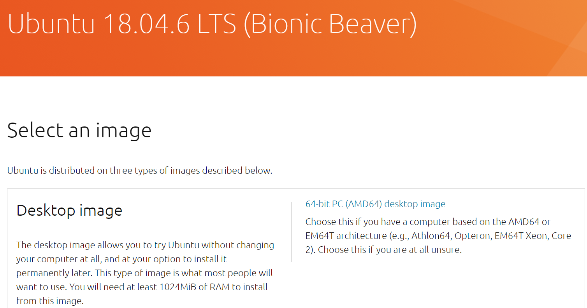
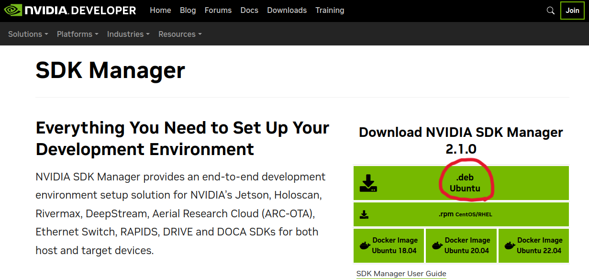
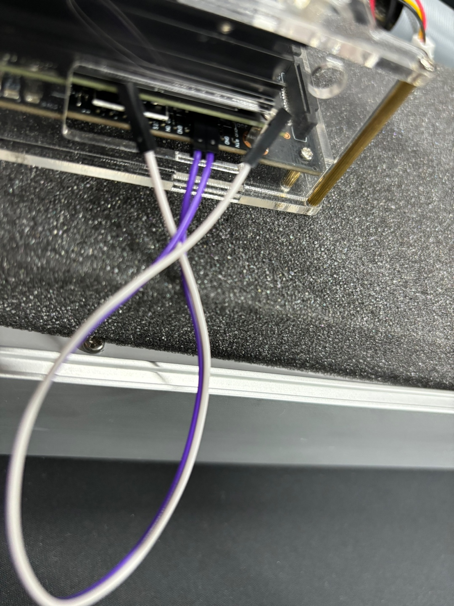
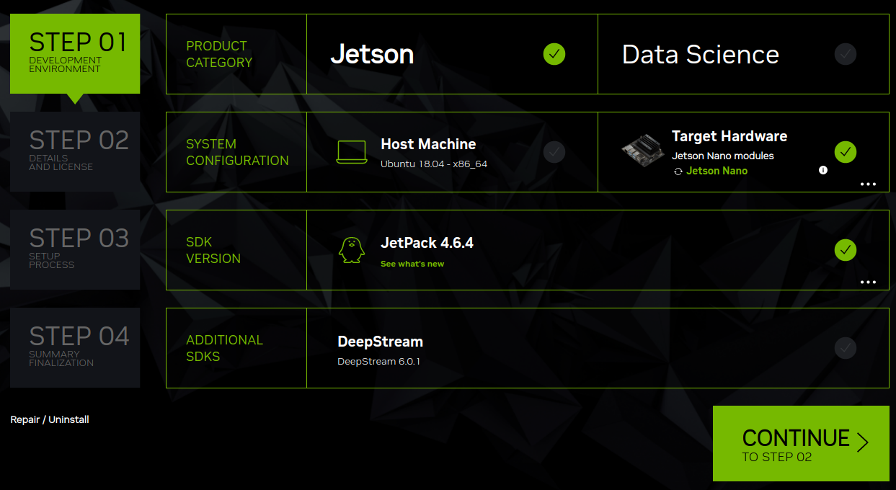
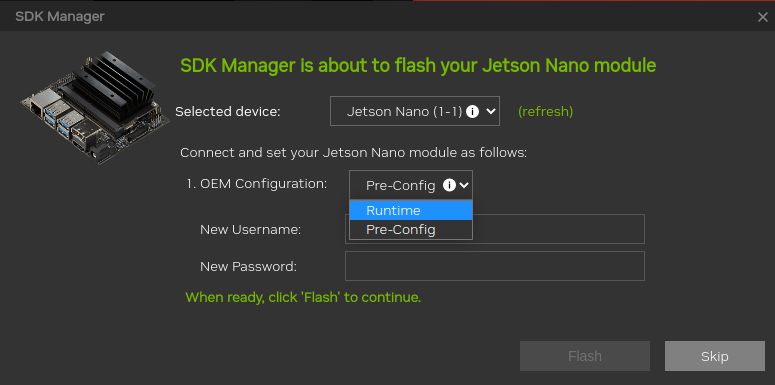

## VMware 가상머신 설치

최신버전 설치 후 Create New Virtual Machine 클릭
리눅스 우분투 iso 파일이 필요함

## Ubuntu 18.04.6 LTS 설치

최신버전 우분투는 나노젯슨 JETPACK이 설치되지 않아서 진행하다 막히게된다
반드시 해당 버전을 찾아서 설치할 것

VMware 로 돌아와서 디스크 사이즈는 100GB 이상 메모리는 8GB 이상 으로 설정해서 만든다

우분투 사용자이름 및 비밀번호 입력 후 팝업창이 뜨면 우분투 관련 업그레이드 거절하기
- No, don't send system info
- Don't Upgrade
- Remind Me Later

## NVIDIA SDK MANAGER 설치

VMware 우분투에서 파이어폭스에 들어가서 아래주소 검색

https://developer.nvidia.com/nvidia-sdk-manager

deb 파일로 다운로드 후 설치 (회원가입 후 이메일로 로그인해야 다운가능, 실행 후에도 계정 필요)

## 젯슨 나노 OS 설치 시작

캐리어 보드 FC REC (3번째) 핀과 GND (4번째) 핀을 점프선으로 쇼트시켜서 REC flashing MODE 세팅

이후 디스플레이, 키보드/마우스, 이더넷 연결 후 VMware가 설치된 PC와 5핀 to USB 로 연결

VMware 에서 NEW USB device가 잡히면 Connect to virutal machine 으로 연결하고

NVIDIA SDK MANAGER 실행 후 로그인

- Privacy Notice 창이 나오면 No, disable usage collection 클릭
- 젯슨 나노 보드가 연결되면 젯슨나노 종류를 고르는 창이 나옴 본인거 선택

STEP 01 에서 사진과 같이 체크하고 CONTINUE 클릭
STEP 02 에서 모두 다 체크 후 CONTINUE 클릭

설치 중간 이창이 나오면 Runtime 선택

22% 정도 설치가 완료되면 OS flashing 이 완료되어서 젯슨나노에 연결된 디스플레이에서 우분투가 켜짐
- 사용자 이름과 패스워드를 설정하고 설치완료 하기
- SDK Manager 로 돌아와서 젯슨 나노보드의 IP (자동으로 안잡히면 젯슨나노에서 ifconfig 명령어로 확인), 사용자이름과 패스워드를 입력하고 나머지 JETSON SDK 컴포넌트들을 설치하기

## 완료

SDK manager 에서 초록색버튼 FINISH 가 뜨고 젯슨 나노 보드에서 eMMC 용량이 부족해서 경고창이 뜬다면 완성
(필자는 설치도중 오류가나고 가상머신이 뻑나서 3번시도 후 완료됨)

다음편에서는 루트파일 SD카드로 옮기는 과정을 알아보겠습니다
