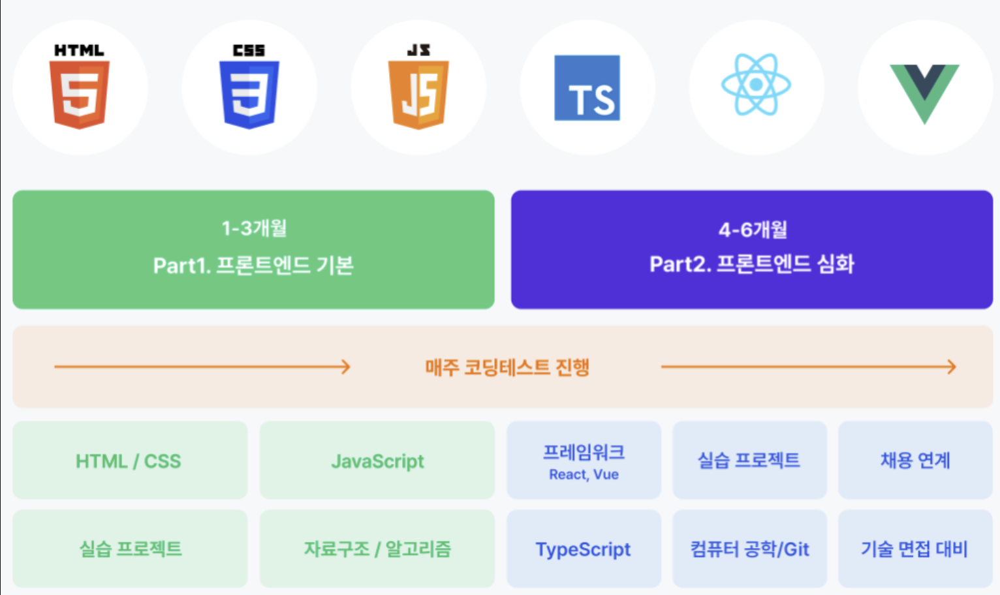
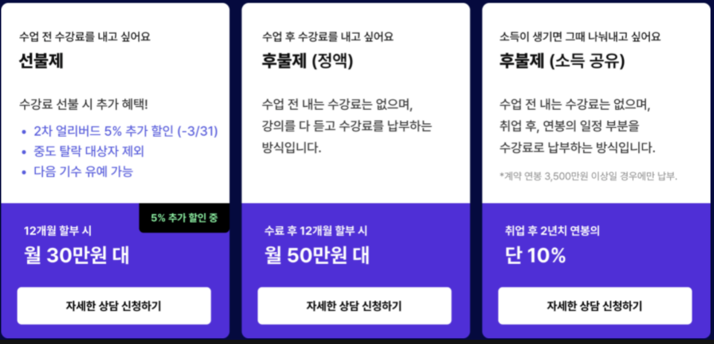

## 고민하게 된 계기
대학교 막바지 무렵, 학교를 다니면서 비교과 과목이나 취업지원제도의 국비지원 교육을 통해 코딩을 배우기 시작했다. 무료로 수강할 수 있는 국비교육들은 깔짝 맛만보는 수준이었기에 매우 기초적인 개념을 배우는 정도와 클론코딩 정도의 수업을 들은 정도여서 프로그램이 어떤 구조로 동작하는지 이해할수도 없었고 실무에 많이 사용되는 프레임워크들의 사용법을 익힐 수도 없었다.

국비지원 수업들을 통해 느낀 점은 100% 무료로 들을 수 있는 단기 과정들은 깊이가 부족해서 전혀 취업에 도달할 정도의 실력을 쌓을 수 없는 정부의 눈먼돈 타먹기 같다는 것이었다. 결국 취업시장에 뛰어들 수 있을 정도의 실력을 만들기 위해선 정부가 비용의 일부분을 지원해주지만 수백만원의 자기부담금이 필요한 코딩 학원 혹은 유료부트캠프 에서 1년 이상의 시간동안 공부해야 한다고 생각했다.





취업 후 상환 방식으로 다닐 수 있는 부트캠프도 있었지만 유명 부트캠프들은 서울에서 자취를 해야만 다닐 수 있는 환경이라 집근처로 다니기 위해 코딩학원을 알아보게 되었다. 코딩학원은 서울에서 자취를 하며 부트캠프를 다니는 것과 비교하면 저렴하지만 역시나 적어도 500먄원 정도의 비용은 발생할 것 같았고, 비용이 부담스러워서 온라인으로 유료인강을 구매하거나 유명 코딩학원의 유튜브를 멤버쉽 유료구독 하고 녹화된 학원강의를 수강하는 방법도 찾아보았다. 


그러던 중 지인에게 폴리텍 대학도 알아보라는 이야기를 듣고 우연히 전단지를 주웠는데 폴리텍대학에 1년동안 코딩을 배울 수 있는 하이테크과정이 있다하여 알아보게 되었다. 장단점을 비교해보자면 다음과 같다. 


## 코딩 학원의 장점과 단점

#### **장점:**
1. **실무 중심 교육:** 웹개발 분야에서 실무에 써먹을 수 있는 프로그래밍언어와 프레임워크에 대해 더 실무에 가까운 커리큘럼이 짜여져 있어 실력을 빠르게 늘리기에 유리하다.
2. **난이도 선택가능**: 자신의 수준에 맞춰서 더 어려운 과정의 수업을 선택적으로 들을 수 있다는 장점이 있다.

#### **단점:**
1. **비용:** 수백만원의 학원비와 별도의 식비와 교통비가 추가로 들 수 있다.
2. **취업 지원:** 체계적인 취업지원이 없어서 수료 후 취업에 불리할 수 있다.
3. **한정된 분야**: 가장 수요공급이 많은 웹분야 말고는 커리큘럼이 없다.

## 폴리텍 대학의 장점과 단점

#### **장점**:
1. **경제적인 부담이 없음:** 교육 비용뿐만 아니라 식비와 숙소(1인실) 모두 무료로 제공된다. 심지어 교통비도 지급된다.
2. **최고급 시설과 장비:** 직접 경험해보고 놀랬다. 카페같은 강의공간과 학생이 사용하는 장비가 라이젠9 CPU가 장착된 고가의 데스크톱과 LG 4K 듀얼모니터에 원한다면 500만원 상당의 최고사양 최신 맥북프로 까지 쓸 수 있었다.
3. **필요한 교재 지원:** 교재를 무료로 제공해 주는데 시중에서 가장 많이 팔리는 유명한 '자바의 정석' 과 '모던자바스크립트딥다이브' 등을 교재로 받을 수 있었다.
4. **종합적인 교육:** 단순히 코딩 능력만을 키우는 것이 아니라, 공모전 참가, 자격증 준비, 프로젝트 발표 등 다양한 경험을 할 수 있다.
5. **취업 지원:** 같은지역 IT 회사 사장님들 앞에서 프로젝트를 발표하거나 면접을 볼 수 있는 기회가 있다. 특히 다른 도시로 가지 않고 취직하고 싶다면 취업 알선을 통해 실제 취업으로 이어지기에 더 유리하다.

#### **단점**:
1. **자격요건**: 폴리텍의 다른 과들과 다르게 코딩과 관련된 학과는 초대졸 이상만 입학할 수 있다는 조건이 있었다.
2. **커리큘럼**: C언어, 임베디드, 자바, 파이썬, 인공지능, 유니티, 웹 등 짧은 기간안에 모든걸 다 배우는 짬뽕 커리큘럼이다. 즉 무엇하나 깊이있게 배우는 것이 불가능하다. 혹은 내가 웹만 공부할 계획인데 인공지능이나 임베디드등에 관해서 공부해야 할 일도 생긴다. 폴리텍에 들어오기에 가장 망설여졌던 부분이다.
3. **낮은 난이도의 수업**: 비전공자를 대상으로 수업하기 때문에 내가 그동안 공부했었던 기초부분을 다루는 수업을 또 들어야 해서 시간이 아깝게 느껴졌다. 그리고 다양한 주제를 다루기 때문에 심화학습은 개인적으로 해야하고 수업시간엔 다양한 분야의 기초만을 배우게 된다.

## 결론 및 후기

경제적인 메리트가 너무 컸기에 폴리텍 대학을 선택했고 수업에서 얻을 수 없는 부분은 다니는 동안 독학으로 채우면 된다고 생각했다. 어차피 학원을 선택하더라도 깊이있는 지식을 얻기 위해선 스스로 공부하는 수 밖에 없기도 하다고 생각한다.


#### 현실적인 어려움
실제로 와서 3개월 정도 다니면서 느낀점은 앞서 설명 했듯 경제적인 메리트가 매우 크지만 커리큘럼은 짧은 기간에 워낙 이것저것 다배우기도 하고 기초적인 부분 위주로 배우느라 수업에서 얻을 수 있는게 학원에 비해 적다는 것이다. 거기다가 들어오자마자 3월부터 이제 변수가 뭔지 배우는 상황에서 아무런 실력도 없는 비전공자끼리 팀을 짜서 실제로 팀프로젝트를 수행하는 ICT멘토링 공모전도 참여하게 되고 정보처리기사 공부도 해야한다. 

그 결과 개인적으로 할 코딩공부할 것은 산더미 인데 시간은 매우 부족하여 잠을 줄여가며 내 공부가 아닌 다른걸 이것저것 쳐내는 정신 없는 삶을 보내게 된다. 아침부터 오후4~6시 까지 일과의 대부분은 기초적인 코딩을 배워야 하므로, 내가 하고 싶은 분야의 실력을 쌓는 코딩공부를 하고 싶은데 팔자에도 없던 공모전 프로젝트를 쳐내거나 자격증 공부를 하고 있으면 내가 지금 뭘 하는 건가 싶을 수도 같다. 다 필요한 거라 생각하고 열린 마음으로 모두 경험해 본다는 마음가짐이 없다면 스트레스를 많이 받게 될 것이다. 이 부분이 현실적인 가장 큰 단점이라고 생각한다.

#### 와서 정말 좋았던 점
단순히 코딩실력을 쌓으면 취직이 된다고 생각하면 폴리텍의 교육과정이 인생에 방해만 된다고 느껴질 수 있지만, 필자가 여기와서 느낀 건 독학하던 학생시절과 비교해서 교수님들이 멘토 역할을 해주시기에 시야가 넓어진다는 것이다. 단순히 웹개발을 죽어라 공부해서 실력을 쌓으면 취직을 할 수 있는 것이 아니라 현장경험 없이 독학으로 공부를 아무리 해도 실력에 한계가 있다는 것과 그런 이유로 현장에서 신입들을 뽑을 때 실력을 기대하고 뽑지 않기 때문에 다른 것으로 어필할 수 있어야 한다는 인사이트는 혼자 공부하는 걸 선택했더라면 알 수 없었던 부분이다.

자격증과 영어를 매우 강조하시는 부분도 원래는 필요성을 느끼지 못했던 부분이었지만 워낙 강조하시기에 공부하게된 정보처리기사도 가채점 상 합격할 예정이고, 토익공부도 하고 있는데 혼자 공부하거나 학원을 선택했을 때 보다 이 길이 취직에 더 유리할 것으로 예상된다. 무엇보다 웹 하나만 보는 학원 쪽은 이미 수많은 부트캠프와 학원으로 인해 웹 분야에 경쟁자들이 쏟아져 나와 직원 20명 수준의 작은 중소기업도 경쟁률이 1000 : 1 수준이 되었다는걸 취업에 관한 리서치를 과제로 하던 중 사람인을 통해 실제로 확인하게 되었다.

웹에 관련된 회사도 갈 수 있지만 원래 비전공자라면 접하기 어려운 임베디드나 C# 계열의 회사에 취직하기 위해 필요한 방향을 지도받거나 관련된 수업을 들을 기회도 있었다. 웹 관련 채용시장이 레드오션이 되어 다른 분야의 개발을 노린다면 폴리텍은 거의 유일한 선택지가 될 수도 있을 것 같다. 심지어 여기는 국방, 항공, 제조업계 등 관련 회사에 직접 취업 알선을 해주기도 한다. (웹으로 가려는 학생들도 많고 웹 수업을 맡은 교수님이 수업을 압도적으로 잘하셔서 웹으로 갈 학생들은 웹을 배우는 금요일만 기다리고 있다.)

#### 마지막으로
필자는 폴리텍 대학에 온 선택이 정말 행운이라고 느끼고 있다. 또 무엇인가를 훈련하는 것에 있어서 혼자 도전하는 것이 참 위험하다는 것을 느꼈다. 이미 경험한 사람이 주변에서 조언해주고 지켜봐주는 것이 얼마나 큰 가치를 가지고 있는지 크게 체감하고 있다. 폴리텍이 IT업계에 취직하는데에도 충분히 좋은 선택지가 될 수 있다는 점을 전해주고 싶었고, 꼭 폴리텍을 선택하지 않더라도 시야가 좁아지지 않도록 멘토를 접할 수 있는 환경을 선택하길 권하고 싶다.

```toc

```
