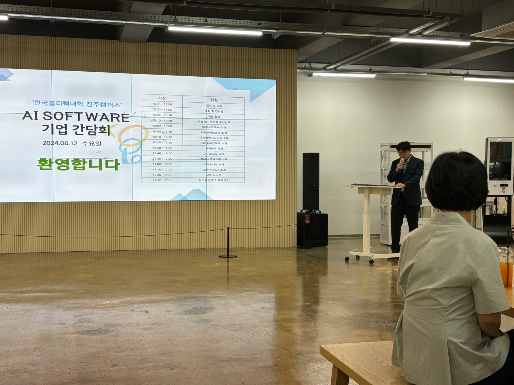
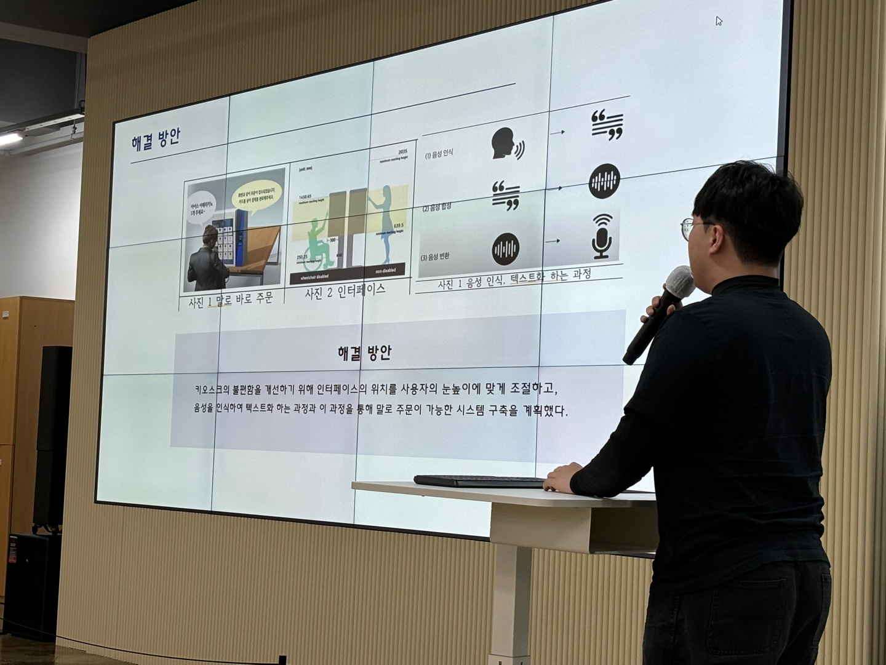
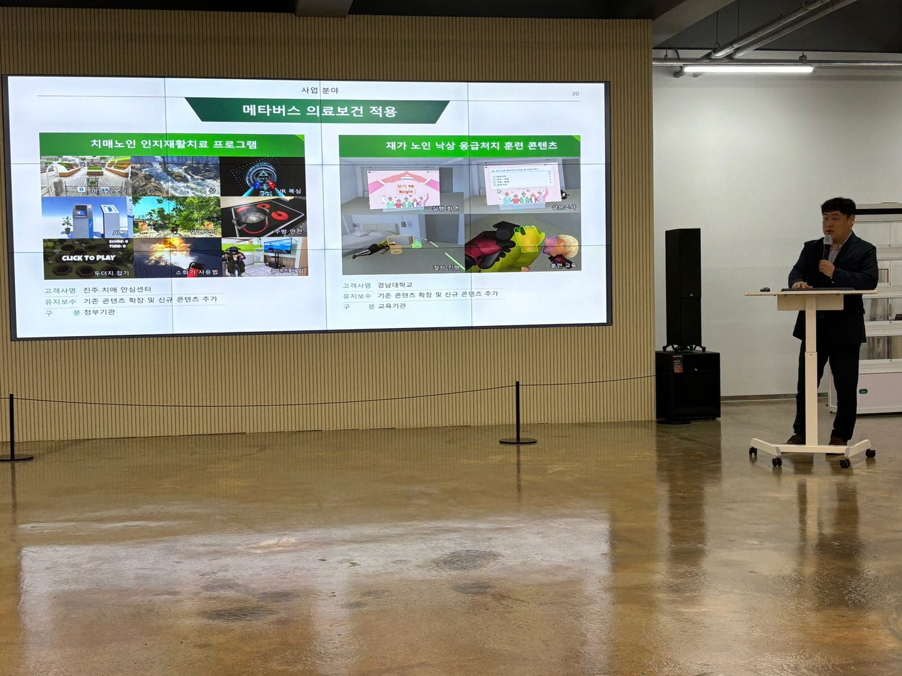

6월 12일 한국폴리텍대학 진주캠퍼스 AI소프트웨어과에서 진행된 AI소프트웨어과 기업 간담회가 성공적으로 마무리되었다. 이번 행사는 AI소프트웨어과 학생들이 팀 프로젝트를 발표하고, 진주 지역의 여러 개발 회사들이 참여하여 학생들의 결과물을 보면서 질문시간을 가지고, 기업분들은 자신들의 회사를 소개하는 발표후 학생들의 질문을 받는 방식으로 진행되었다.




(한 학생이 본인 팀이 만들고 있는 키오스크 서비스에 대해서 설명하는 모습)

이번 행사는 학생측에서 얻을게 정말 많은 기회의 장이었다. 팀프로젝트를 진주지역의 거의 모든 개발회사의 이사나 대표님들 앞에서 발표하면서 실력을 어필할 수 있는 기회이자, 실제로 개발을 진행하게 될 때, 어떤 식으로 프로덕트가 기획되고 발표를 준비해야 하는지에 대한 작은 실전의 기회이기도 했다. 5분이라는 시간동안 최대한 중요한 포인트들을 짚어가면서 프로젝트를 설명하는 연습은 살면서 폴리텍대학에 왔기에 해볼 수 있는 경험이었지 않나 싶다.



(기업관계자 분이 본인 회사가 하는 일에 대해 설명하는 모습)

학생들의 발표가 마무리 된 후 다음 순서로 기업분들의 발표 순서가 이어졌다. 참여 기업들로 보아하건데, 진주지역은 웹 서비스 회사가 많이 없고 사천에 있는 KAI 와 항공산업에 관련된 프로젝트를 수행하는 회사가 더 많다는 느낌을 받았다. 기업관계자분들의 회사소개 발표에서는 어떤 프로젝트들을 진행하는지, 회사의 규모나 체계는 어떤식으로 이루어져 있는지 사람인 등의 취업포털로는 얻을 수 없는 디테일한 정보를 얻고 회사에 대해서나 실제 현업에서 필요한 기술과 역량으로 어떤 것들을 기대하시는지 질문할 수 도 있었다.

## 기업 간담회에서 얻은 인사이트

이번 간담회에서는 학생들이 다양한 질문을 통해 기업의 실제 업무 환경과 필요 역량에 대해 질문을 던질 수 있었는데 학생들이 생각하는 방향성과 기업이 기대하는 방향성에 괴리가 크다는 점이 인상적이었다. 여러 기술을 잘 다루는 것을 기대하는데에 비해 가장 기본인 C언어를 깊이 있게 이해하는 것이 중요하다는 것을 강조하시는 분도 계셨고 웹분야의 한 회사 관계자 분은 한가지 언어에 정통한 것 보다는 프로젝트에 맞춰서 여러 언어를 사용하는 것에 거부감이 없는 것을 중요시 하시기도 했다. 특히 공통적으로는, 실력보다는 태도와 인성에 대해 강조한다는 것이었다. 또한 현업에서는 단순한 기술적인 능력뿐만 아니라, 팀원들과 원활히 소통하며 문제를 해결하는 능력이 필수적이라는 점을 배웠다. 이러한 인사이트는 학생들이 앞으로 자신의 진로를 설정하고 준비하는 데 큰 도움이 될 것이라고 생각한다.

## 학생들의 반응

행사에 참여한 학생들은 이번 기회를 통해 실제 현업과의 거리를 좁힐 수 있었다고 입을 모았다. 발표를 준비하고 기업들과 직접 소통하는 과정에서 면접 기회를 얻은 학생들도 있었다. 현업에서 요구하는 것들을 피부로 느끼고 향후 취업 준비에도 만전을 기할 분위기가 조성되는 느낌도 받았다. 이번 행사가 일회성에 그치지 않고 정기적으로 개최되어 더 많은 학생들이 참여할 수 있기를 희망한다.

```toc

```
