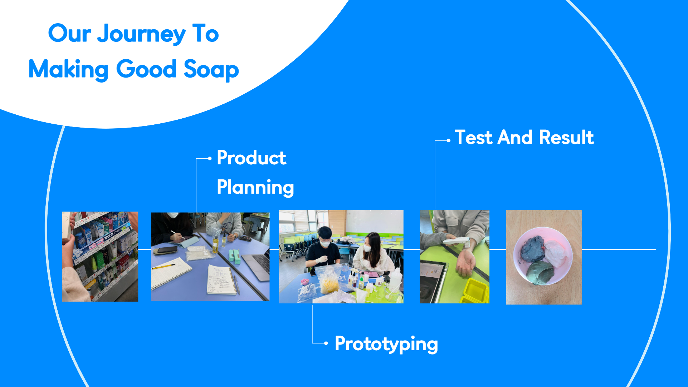
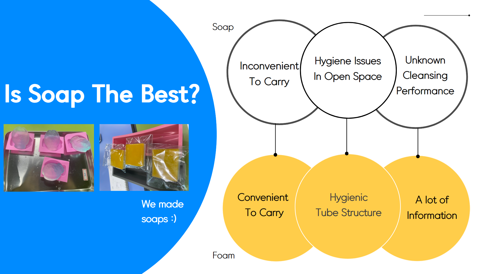
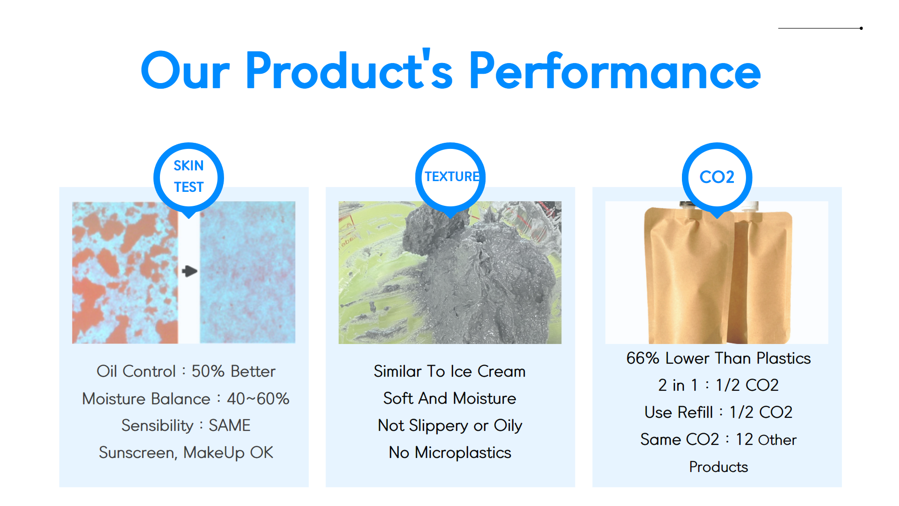
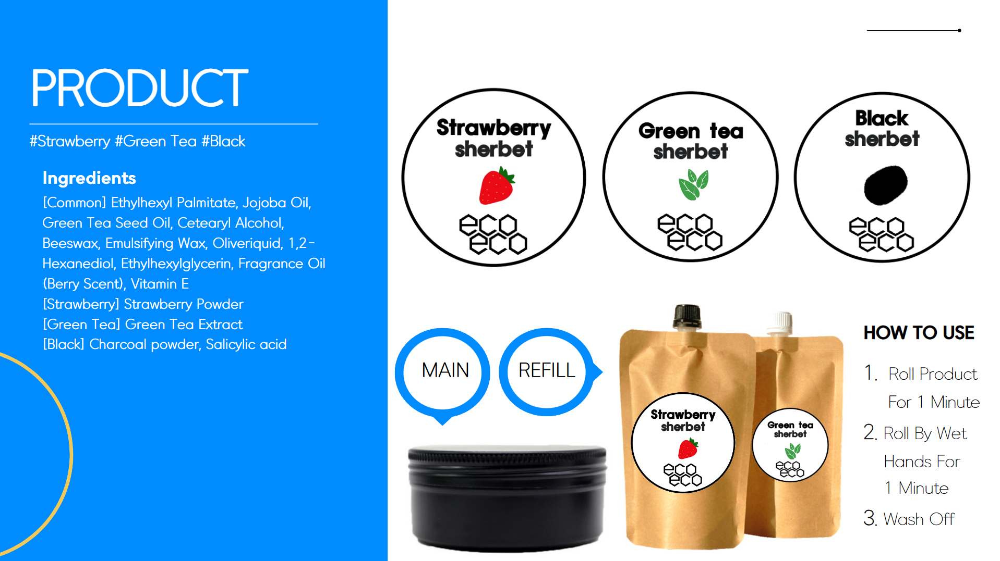

## 캡스톤디자인 주제

탄소중립에 기여할 수 있는 스킨케어 제품 기획 및 제작

## 맡은 역할



### 시장조사 및 자료조사 단계
- 인기 시제품 전성분표 분석
- 제품 방향성 기획 및 PPT 제작
- 프로젝트 기획 프레젠테이션 발표

### 프로토타입 제작 단계
- 화장품 원재료 배합비율 연구 및 테스트
- 미세플라스틱 대체 성분 관련 논문 리서치

### 제품 테스트 및 완성 단계
- 제품 피부 테스트 및 세정력 개선 작업
- 배합비율 조절을 통한 사용감 개선 작업
- 완제품 샘플 제조 및 프로젝트 결과 PPT 제작
- 프로젝트 심사 프레젠테이션 발표

## 제품 제작 트러블슈팅 경험



첫 방향성은 친환경 비누 제품을 밴치마킹하여 만드는 것이었지만, 이미 시장에 포지셔닝이 완료된 제품이고 사람들이 편안하고 익숙한 클렌징폼 제품들 대신 환경을 위해 비누를 사용하도록 설득하는 것이 바람직하지 않아 보였기에 새로운 시도를 해보고 싶었다. 
클렌징폼과 유사한 사람들에게 익숙한 제형과 사용감 그리고 피부타입을 고려한 제품선택권을 유지하면서도 친환경 비누 제품들과 유사한 수준의 탄소절감 효과를 누릴 수 있는 제품을 기획하여 제안하게 되었고 내 제안이 받아들여져 PPT 제작 및 발표 까지 맡아서 프로젝트를 주도적으로 이끄는 역할을 수행하였다.



세안제 제형 및 사용감(잔여감, 세정력 등)에 가장 큰 요인은 가벼운 에틸핵실팔미테이트와 무거운 식물성오일의 비율이 가장 핵심이었다. 식물성 오일이 과다할 경우 아무리 씻어도 오일감이 피부에 남아서 불쾌했고, 반대로 에틸핵실팔미테잍가 과다할 경우는 세정력이 너무 약하고 제형이 너무 묽었다. 
다른 계면활성제 성분들을 섞어서 테스트한 결과 제형이 딱딱하고 세정력이 사라지는 등 문제가 해결 되지 않아 핵심은 비율 조절인 것을 경험하고 실험으로 최적의 비율을 찾아 제품을 개선했다.

## 완성품 및 프로젝트 결과



시장에서 인기있는 피부민감유발 성분을 모두 제외한 구성의 전성분표와 최적의 사용감 및 세정력을 목표로 조절한 배합비율 그리고 피부타입에 맞춰서 3가지 타입으로 선택할 수 있게 구성한 완성품이다. 기업관계자 분들을 모시고 프로젝트를 심사한 프레젠테이션도 맡아서 발표할 때 제품에서 직접 트러블슈팅한 경험들이 많아서 내 생각들을 자연스럽게 전달할 수 있었고, 캡스톤디자인 팀 중 우리팀이 1위를 차지하게 되어 베트남 기업을 탐방할 수 있는 기회도 가지게 되었다.

## 베트남 기업탐방에서 느낀점

큰 제조업 공장 뿐아니라 작은 소프트웨어 개발회사까지 다양한 중소기업들을 탐방하게 되었는데, 제조업 공장들은 MES나 ERP가 적극적으로 도입되어 많은 부분이 전산화 되어 프로젝트가 체계적으로 관리되고 있는점이 인상적 이었다. 국내 공장들 보다 훨씬 깔끔하고 체계있게 운영되고 있다는 인상을 받았다.

```toc

```
