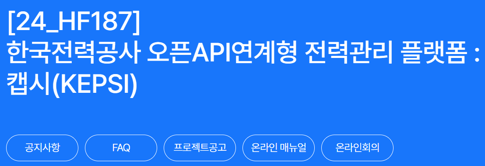

## KEPSI 프로젝트



2024 ICT멘토링 한이음 공모전에 전력관리 플랫폼 개발을 목표로 참가하게 되었다.
하드웨어와 클라우드 서버 웹앱 개발까지 폭넓게 경험해 볼 수 있는 팀프로젝트 경험을 쌓을 것으로 기대됨.

### 프로젝트명
한국전력공사 오픈 연계형 전력관리 플랫폼 (KEPSI)

### 주제영역
- 공공
- 생활/업무

### 기술분야
- SW·AI
- 디바이스

### 성과목표
- 앱 등록
- 공모전 참여

### 수행기간
2024년 3월 ~ 2024년 11월

### 맡은역할
팀장 (팀원 총 3명)

### 프로젝트 배경
전기요금 상승으로 인해 전력 사용량을 효율적으로 관리하고 절전할 수 있는 방안의 필요성이 대두되었다. 한국전력공사가 보유한 방대한 전력 데이터를 활용하여 각 가정의 전력 사용을 모니터링하고 절전 모드를 제공하는 플랫폼을 개발하고자 한다.

### 주요 기능
1. **전력 사용 계획 추천**: 전력 사용량 데이터를 분석하여 효율적인 전력 사용 계획을 추천한다.
2. **절전모드 프리셋 제공**: 사용 패턴을 분석하여 누진세 구간을 넘지 않도록 절전모드를 제공한다.
3. **스마트미터링 솔루션**: 스마트미터기가 도입되지 않은 가정에 스마트미터링 환경을 제공한다.

### 적용 기술
- ESP32 모듈 기반 스마트 플러그 설계
- 누진세 방지 강화학습 알고리즘
- 절전모드 프리셋 구현

### 예상 결과물
- 스마트 플러그
- 전력관리 어플리케이션

### 기대효과 및 활용 분야
- **경제적 이익**: 전력 사용 습관 개선을 통한 사용자의 경제적 이익
- **편의성 증가**: 전력 사용에 대한 편의성 증대와 교육효과
- **에너지 절감**: 가정부터 공공기관까지 다양한 분야에서의 에너지 절감 효과
- **확장 가능성**: 지역 전력망과 발전소까지 연계하여 더 큰 규모의 전력 관리 솔루션으로 확장 가능

### 프로젝트 추진 배경 및 필요성
전기요금 상승과 전력 수요 증가로 인해 효율적인 전력 관리의 중요성이 커지고 있다. 한국전력공사의 방대한 전력 데이터를 활용하여 가정에서 전력 사용을 효율적으로 관리하고 절전할 수 있는 솔루션이 필요하다.


```toc

```
