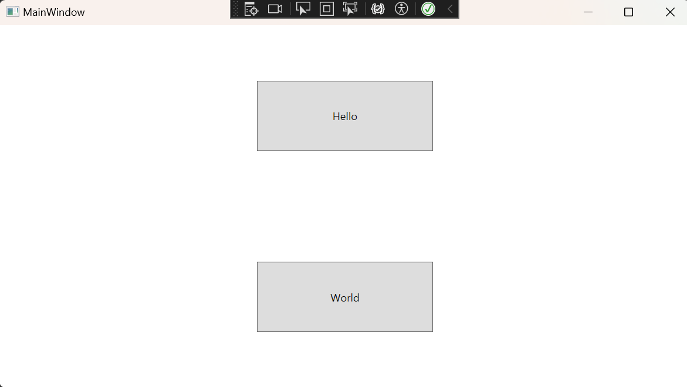

## 시작은 MainWindow

#### MainWindow.xaml

```xaml
<Window x:Class="WPF_Tutorial.MainWindow"
        xmlns="http://schemas.microsoft.com/winfx/2006/xaml/presentation"
        xmlns:x="http://schemas.microsoft.com/winfx/2006/xaml"
        xmlns:d="http://schemas.microsoft.com/expression/blend/2008"
        xmlns:mc="http://schemas.openxmlformats.org/markup-compatibility/2006"
        xmlns:local="clr-namespace:WPF_Tutorial"
        mc:Ignorable="d"
        Title="MainWindow" Height="450" Width="800">
    <Grid>
        <Frame Source="/MenuPage.xaml"></Frame>
    </Grid>
</Window>
```

그리드에 Frame 태그의 Source에 MenuPage링크를 직접 넣어주면 MenuPage의 화면이 띄워짐

#### MenuPage.xaml (그리드부분)

```xaml
<Grid>
    <Grid.RowDefinitions>
        <RowDefinition Height="1*"></RowDefinition>
        <RowDefinition Height="1*"></RowDefinition>
    </Grid.RowDefinitions>

    <Grid Grid.Row="0">
        <Button Width="200" Height="80" Click="Button_Click_1" Content="Hello"></Button>
    </Grid>
    <Grid Grid.Row="1">
        <Button Width="200" Height="80" Click="Button_Click_2" Content="World"></Button>
    </Grid>
</Grid>
```

화면을 Row를 이용해 2분할하고 Hello 버튼과 World 버튼을 넣고 각각의 클릭 이벤트를 만듬
- 넓이와  넓이를 직접 지정해주면 자식 요소는 부모 요소의 크기 만큼 당겨주는 특징 때문에 가운데 정렬됨

#### MenuPage.cs

```C#
namespace WPF_Tutorial
{
    /// <summary>
    /// MenuPage.xaml에 대한 상호 작용 논리
    /// </summary>
    public partial class MenuPage : Page
    {
        public MenuPage()
        {
            InitializeComponent();
        }

        private void Button_Click_1(object sender, RoutedEventArgs e)
        {
            Uri uri = new Uri("/page1.xaml", UriKind.Relative);
            NavigationService.Navigate(uri);
        }

        private void Button_Click_2(object sender, RoutedEventArgs e)
        {
            Uri uri = new Uri("/page2.xaml", UriKind.Relative);
            NavigationService.Navigate(uri);
        }
    }
}
```

각 버튼의 클릭이벤트에서 URI를 생성하고 Navigate 를 이용해 각 페이지로 이동하도록 구현함
- page1.xaml 과 page2.xaml은 Grid 안에 TextBlock을 만들어서 Hello 와 World 를 찍었음

## 결과



각 버튼을 누르면 가운데에 Hello 와 World 가 출력됨
WPF는 뒤로가기를 구현하지 않아도 자동으로 생성됨

```toc

```
